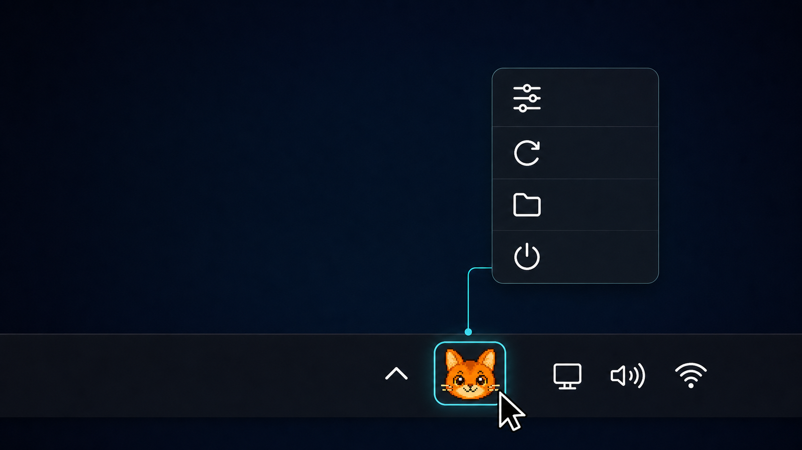

<p align="center">
  
</p>

<p align="center">
  <a href="https://github.com/himomohi/Codexy-pet-usages-ring/releases/latest"></a>
  <a href="VERSION"></a>
  <a href="LICENSE"></a>
  
  
</p>

<p align="center">
  <a href="#빠른-시작">빠른 시작</a>
  · <a href="#다운로드">다운로드</a>
  · <a href="#명령">명령</a>
  · <a href="#개인정보">개인정보</a>
  · <a href="README.md">English</a>
</p>

Codex Pet Limit Rings for Windows는 Codex Desktop `/pet` 아바타 주변에 반투명
사용량 링을 표시하는 companion overlay입니다.
[petergpt/codex-pet-limit-rings](https://github.com/petergpt/codex-pet-limit-rings)
의 companion-app 방식을 Windows용 PowerShell, WPF, Win32 창 제어로 구현했습니다.

## 기능

- 원형 링, 듀얼 바, 사이드 게이지, 코너 프레임, 레퍼런스 기반 픽셀 포션 오브 중에서 표현 방식을 선택합니다.
- 5h와 주간 잔여 사용량을 항상 표시하거나 마우스 호버 시에만 표시할 수 있습니다.
- 이벤트로 5h 제한이 사라져도 주간 사용량을 주간 위치에 유지하고, 사용할 수 없는 5h 값은 `-`로 표시합니다.
- 표현 위치·간격을 펫 기준으로 조정하고 한 번에 중앙정렬할 수 있습니다.
- 포션 크기는 70~140% 범위에서 펫 비율에 맞게 조정합니다.
- 좌측 5h와 우측 주간 hover readout을 분리하며 Noto Sans KR 글꼴을 사용합니다.
- 언어가 자동이면 공인 IP가 한국일 때 한국어, 그 외 국가에서는 영어를 선택합니다.
- Codex Desktop을 자동 감지하고 필요하면 실행합니다.
- 재부팅 후 남은 열림 상태나 오래된 좌표 대신 실제로 보이는 Codex Pet 창이 있을 때만 HUD를 표시합니다.
- `/pet`가 보일 때까지 조용히 대기한 뒤, 두 사용량 표시를 펫의 현재 실시간 위치 양쪽에 자동 배치합니다.
- WPF 기반 click-through overlay라서 마우스 입력을 가로채지 않습니다.
- 기본 설치 시 Windows 시작프로그램 바로가기를 만들어, 로그인 후 조용히 대기하다 `/pet`가 나타나는 즉시 HUD를 표시합니다.
- 루트 `.bat` 파일로 설치, 설정, 상태 확인, 시작, 중지, 제거를 더블클릭 실행할 수 있습니다.
- Windows 작업표시줄 알림 영역의 고양이 얼굴 아이콘을 마우스 오른쪽 버튼으로 눌러 설정, 새로고침, 로그 열기, 종료를 바로 실행할 수 있습니다.

## 요구 사항

- Windows 10 또는 Windows 11.
- Codex Desktop 설치 및 로그인.
- PowerShell 5.1 이상.
- 사용량 표시가 보이려면 Codex `/pet` 오버레이가 열려 있어야 합니다.

Python은 선택 사항이며 로컬 SQLite 로그 fallback에만 사용됩니다.

## 다운로드

가장 쉬운 방법은 [GitHub 최신 릴리스](https://github.com/himomohi/Codexy-pet-usages-ring/releases/latest)에서 `codex-pet-limit-rings-Win-0.1.24.zip`을 다운로드하고 일반 폴더에 압축을 푼 다음 `Install.bat` 또는 `Manage.bat`을 더블클릭하는 것입니다.

GitHub의 **Code → Download ZIP**으로 저장소 전체를 내려받아 설치해도 됩니다. 개발용으로는 다음처럼 clone할 수 있습니다.

```powershell
git clone https://github.com/himomohi/Codexy-pet-usages-ring.git
cd Codexy-pet-usages-ring
.\Install.bat
```

## 빠른 시작

가장 쉬운 방법은 이 폴더의 `Manage.bat`을 더블클릭하는 것입니다. 설치,
자동 실행 설치, 상태 확인, 설정, 중지, 완전 제거를 한 화면에서 선택할 수 있습니다.

바로 실행하려면 다음 파일을 더블클릭하세요.

- `Install.bat`: 설치 후 즉시 실행하고 재부팅 후에도 동작하도록 Windows 자동 시작을 등록합니다.
- `Install-AutoStart.bat`: 같은 영구 설치를 명시적으로 실행하는 호환용 진입점입니다.
- `Apply-Installed.bat`: 이후 소스 변경을 현재 설치본에 적용합니다. 설정을 보존하고 기존에 실행 중이었을 때만 재시작합니다.
- `Uninstall.bat`: 실행 중인 링, 바로가기, 설치본을 완전히 제거합니다. 이 소스 폴더는 남깁니다.

설치 후 Codex Desktop에서 `/pet`를 열면 선택한 사용량 표시가 나타납니다.
왼쪽/바깥쪽은 5시간, 오른쪽/안쪽은 주간 잔여 사용량이며, 표시에 마우스를
올리면 정확한 비율, 초기화 시간, 실시간으로 갱신되는 남은 시간을 볼 수 있습니다.

Installer는 파일을 `%LOCALAPPDATA%\CodexPetLimitRingsWin`에 복사하고 helper를
시작한 뒤 Windows 로그인 자동 시작을 등록합니다. 로그인 시 Codex Desktop을
강제로 열지는 않으며, 조용히 대기하다 Codex `/pet`가 나타나면 HUD를 표시합니다.
PowerShell installer에 `-NoStartup`을 지정하면 자동 시작을 제외할 수 있습니다.

PowerShell 설치:

```powershell
powershell -ExecutionPolicy Bypass -File .\bin\powershell\Install.ps1
```

PowerShell을 직접 실행할 때는 `-Startup`을 추가해야 자동 시작이 등록됩니다.
권장 재부팅 안전 설치는 `Install.bat`을 사용하세요.

## 명령

더블클릭 launcher:

```text
Manage.bat
Install.bat
Install-AutoStart.bat
Apply-Installed.bat
Start.bat
Stop.bat
Status.bat
Settings.bat
Diagnose.bat
Uninstall.bat
```

설치본이 있으면 launcher는 자동으로
`%LOCALAPPDATA%\CodexPetLimitRingsWin` 아래의 설치된 helper를 사용합니다.

원본과 설치본에는 서로를 여는 `설치본 열기.lnk`, `원본 프로젝트 열기.lnk`가 만들어집니다. 원본을 수정한 뒤 `Apply-Installed.bat`을 실행하면 `settings.json`을 보존하면서 설치본을 업데이트할 수 있습니다.

PowerShell:

```powershell
.\bin\powershell\Start.ps1
.\bin\powershell\Stop.ps1
.\tools\Sync-Installed.ps1
.\bin\powershell\Status.ps1
.\bin\powershell\Settings.ps1
.\bin\powershell\Diagnose.ps1
.\bin\powershell\Uninstall.ps1
```

자주 쓰는 설치 옵션:

```powershell
.\bin\powershell\Install.ps1 -NoStartCodex
.\bin\powershell\Install.ps1 -Startup
.\bin\powershell\Install.ps1 -NoStartup -NoStartMenu -NoStart
.\bin\powershell\Install.ps1 -NoLiveUsage
```

설치 파일까지 제거:

```powershell
.\bin\powershell\Uninstall.ps1 -RemoveFiles
```

`-RemoveFiles`는 대상 폴더에 install marker가 있을 때만 동작해서 잘못된 폴더의
재귀 삭제를 막습니다.

## 커스터마이즈

`Settings.bat`을 열거나 아래 명령을 실행하세요:

```powershell
.\bin\powershell\Settings.ps1
```

실행 중에는 Windows 작업표시줄 오른쪽 알림 영역에서 주황색 고양이 얼굴 아이콘을 찾을 수 있습니다. 아이콘이 접혀 있으면 `숨겨진 아이콘 표시` 화살표를 누른 뒤, 고양이 아이콘을 마우스 오른쪽 버튼으로 클릭하고 `설정`을 선택하세요.

<p align="center">
  
</p>

같은 트레이 메뉴에서 `새로고침`, `로그 열기`, `종료`도 프로젝트 폴더를 열지 않고 실행할 수 있습니다.

설정 파일:

```text
%LOCALAPPDATA%\CodexPetLimitRingsWin\settings.json
```

표현 방식, 색상, 투명도, 펫 기준 위치와 간격, 포션 크기, hover readout 색상과
글자 크기를 바꿀 수 있습니다. 실행 중인 helper는 설정 파일 변경을 자동으로
다시 읽습니다.

## 개인정보

앱은 아래 로컬 Codex 파일을 읽습니다:

- `%USERPROFILE%\.codex\.codex-global-state.json`
- `%USERPROFILE%\.codex\auth.json`
- `%USERPROFILE%\.codex\logs_2.sqlite` 또는 `logs_1.sqlite`

OpenAI API key는 필요하지 않습니다. pet 이미지, 스크린샷, 프롬프트, repository
내용, spritesheet는 전송하지 않습니다.

언어가 `자동 (IP 위치)`이면 앱은 `https://api.country.is/`에서 요청자의 국가
코드만 조회합니다. 이 요청 과정에서 서비스는 공인 IP를 확인하지만, 앱은 IP를
저장하지 않고 반환된 두 글자 국가 코드만 로컬에 24시간 캐시합니다. 한국어 또는
영어를 직접 선택하면 이 조회를 건너뜁니다. 조회에 실패하면 Windows UI 언어를
사용합니다.

Live usage는 로컬 Codex access token을 아래 주소에만 사용합니다:

```text
https://chatgpt.com/backend-api/wham/usage
```

네트워크 live usage는 `-NoLiveUsage`로 끌 수 있습니다.

설정 페이지는 random session token이 있는 임시 `127.0.0.1` 서버를 사용하고,
로컬 `settings.json` 파일만 씁니다.

## 주의

- OpenAI 또는 Codex의 공식 기능이 아닙니다.
- Live usage endpoint는 문서화된 외부 API가 아니므로 바뀔 수 있습니다.
- 링은 `/pet`가 열려 있을 때만 보입니다.

## AI 설치 지시

Repository URL:

```text
https://github.com/himomohi/Codexy-pet-usages-ring
```

AI agent에게 아래 repository URL과 함께 Windows 설치를 요청하세요:

```text
Install Codex Pet Limit Rings for Windows from:
https://github.com/himomohi/Codexy-pet-usages-ring

If the repository is not local, clone it first. Then run Install.bat from the
repository root. After installation, run Status.ps1 and Diagnose.ps1 to verify
that the helper is installed, running, and waiting for or following /pet.
```

CLI equivalent:

```powershell
powershell -ExecutionPolicy Bypass -File .\bin\powershell\Install.ps1
.\bin\powershell\Status.ps1
.\bin\powershell\Diagnose.ps1
```

## 더 보기

- [CHANGELOG.md](CHANGELOG.md)
- [SECURITY.md](SECURITY.md)
- [docs/troubleshooting.md](docs/troubleshooting.md)
- [docs/architecture.md](docs/architecture.md)
- [NOTICE.md](NOTICE.md)

Release zip 만들기:

```powershell
.\tools\New-ReleaseZip.ps1
```

기능 추가와 버그 수정 release는 `VERSION`, README badge, `CHANGELOG.md`의
최상단 버전을 함께 올립니다.
