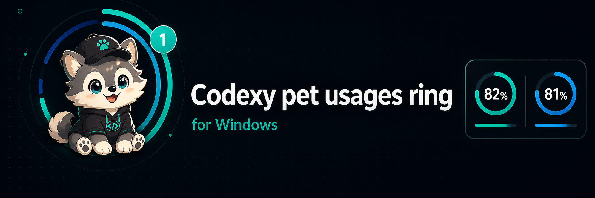

<p align="center">
  
</p>

<p align="center">
  <a href="https://github.com/himomohi/Codexy-pet-usages-ring/releases/latest">
    
  </a>
</p>

<p align="center">
  <a href="CHANGELOG.md#016"></a>
  <a href="LICENSE"></a>
  
  
</p>

<p align="center">
  <a href="#快速开始">快速开始</a>
  · <a href="#命令">命令</a>
  · <a href="#隐私">隐私</a>
  · <a href="README.md">English</a>
  · <a href="README.ko.md">한국어</a>
  · <a href="README.ja.md">日本語</a>
  · <span>中文</span>
</p>

Codexy pet usages ring 会在 Codex Desktop 的 `/pet` 头像周围绘制半透明的
用量限制圆环。它是
[petergpt/codex-pet-limit-rings](https://github.com/petergpt/codex-pet-limit-rings)
的 Windows companion 实现，使用 PowerShell、WPF 和 Win32 窗口定位。

<p align="center">
  <a href="docs/assets/usage-rec.mp4">
    
  </a>
</p>

<p align="center">
  不用每隔几分钟检查一次用量页面。<br>
  让 pet 替你显示就好。
</p>

<!-- Features -->

## 功能

- 在当前 Codex `/pet` 头像周围显示圆环或小型电池条。
- 悬停时显示 5h 限制和每周限制的用量信息。
- 将 readout、tray text 和设置 UI 本地化为英语、韩语、日语和中文。
- 自动检测 Codex Desktop，并可在需要时启动它。
- 在 `/pet` 可见之前保持安静等待。
- 使用 WPF click-through overlay，不会拦截鼠标输入。
- 可创建 Windows 启动项和开始菜单快捷方式。
- 提供根目录 `.bat` launcher，可双击执行安装、设置、状态、启动、停止和卸载。

<!-- Requirements -->

## 要求

- Windows 10 或 Windows 11。
- 已安装并登录 Codex Desktop。
- PowerShell 5.1 或更高版本。
- 若要显示圆环，需要打开 Codex `/pet` overlay。

Python 是可选项，仅用于本地 SQLite log fallback。

<!-- Quick Start -->

## 快速开始

1. 下载或 clone 此 repository。
2. 打开 repository 文件夹。
3. 双击 `Install.bat`。
4. 在 Codex Desktop 中使用 `/pet`。

Installer 会将文件复制到 `%LOCALAPPDATA%\CodexPetLimitRingsWin`，启动 helper，
并将其注册到 Windows 启动项。

PowerShell 安装:

```powershell
powershell -ExecutionPolicy Bypass -File .\bin\powershell\Install.ps1
```

## 命令

双击 launcher:

```text
Install.bat
Start.bat
Stop.bat
Status.bat
Settings.bat
Uninstall.bat
```

如果已安装，这些 launcher 会自动使用
`%LOCALAPPDATA%\CodexPetLimitRingsWin` 下的已安装 helper。

PowerShell:

```powershell
.\bin\powershell\Start.ps1
.\bin\powershell\Stop.ps1
.\bin\powershell\Status.ps1
.\bin\powershell\Settings.ps1
.\bin\powershell\Diagnose.ps1
.\bin\powershell\Uninstall.ps1
```

常用安装选项:

```powershell
.\bin\powershell\Install.ps1 -NoStartCodex
.\bin\powershell\Install.ps1 -NoStartup -NoStartMenu -NoStart
.\bin\powershell\Install.ps1 -NoLiveUsage
```

同时删除已安装文件:

```powershell
.\bin\powershell\Uninstall.ps1 -RemoveFiles
```

`-RemoveFiles` 只有在目标目录中存在 install marker 时才会执行，避免误删错误文件夹。

## 自定义

打开 `Settings.bat`，或运行:

```powershell
.\bin\powershell\Settings.ps1
```

设置文件:

```text
%LOCALAPPDATA%\CodexPetLimitRingsWin\settings.json
```

你可以在圆环/电池显示之间切换，并更改颜色、透明度、readout 颜色和 hover text
大小。正在运行的
helper 会自动重新加载设置文件。

## 隐私

此 app 会读取以下本地 Codex 文件:

- `%USERPROFILE%\.codex\.codex-global-state.json`
- `%USERPROFILE%\.codex\auth.json`
- `%USERPROFILE%\.codex\logs_2.sqlite` 或 `logs_1.sqlite`

它不需要 OpenAI API key，也不会发送 pet 图片、截图、prompt、repository 内容或 spritesheet。

Live usage 只会将本地 Codex access token 用于:

```text
https://chatgpt.com/backend-api/wham/usage
```

可使用 `-NoLiveUsage` 禁用网络 live usage。

设置页面会运行一个带 random session token 的临时 `127.0.0.1` server，
并且只写入本地 `settings.json` 文件。

## 注意

- 这不是 OpenAI 或 Codex 的官方功能。
- Live usage endpoint 不是公开文档化的 third-party API，未来可能发生变化。
- 只有打开 `/pet` 时才会显示圆环。

## AI 安装交接

Repository URL:

```text
https://github.com/himomohi/Codexy-pet-usages-ring
```

可以把下面的 repository URL 交给 AI agent，让它在 Windows 上安装:

```text
Install Codexy pet usages ring from:
https://github.com/himomohi/Codexy-pet-usages-ring

If the repository is not local, clone it first. Then run Install.bat from the
repository root. After installation, run Status.ps1 and Diagnose.ps1 to verify
that the helper is installed, running, and waiting for or following /pet.
```

CLI equivalent:

```powershell
powershell -ExecutionPolicy Bypass -File .\bin\powershell\Install.ps1
.\bin\powershell\Status.ps1
.\bin\powershell\Diagnose.ps1
```

## 更多

- [CHANGELOG.md](CHANGELOG.md)
- [SECURITY.md](SECURITY.md)
- [docs/troubleshooting.md](docs/troubleshooting.md)
- [docs/architecture.md](docs/architecture.md)
- [NOTICE.md](NOTICE.md)

创建 release zip:

```powershell
.\tools\New-ReleaseZip.ps1
```

功能版本和 bug fix release 应同时更新 `VERSION`、README badge 和 `CHANGELOG.md`
顶部版本。
